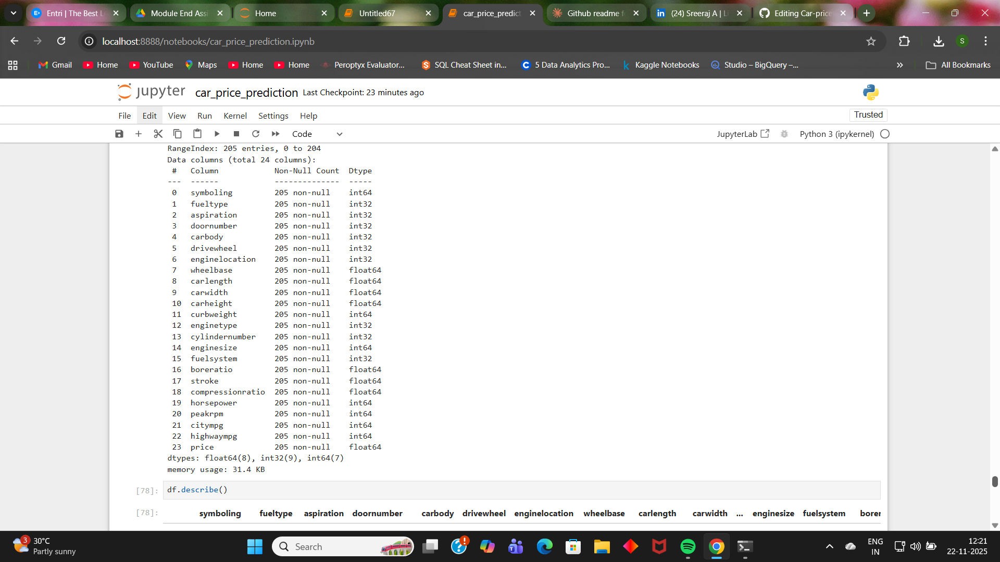

# Car Price Prediction using Machine Learning

A comprehensive machine learning project that predicts car prices using multiple regression algorithms. This project implements, compares, and optimizes five different regression models to identify the best predictor of car prices.

## 📋 Project Overview

This project explores various regression techniques to predict car prices based on multiple features. By comparing five different algorithms and performing hyperparameter tuning, this analysis demonstrates end-to-end machine learning workflow from data preprocessing to model optimization.

## 🎯 Objectives

- Implement and compare five regression algorithms for car price prediction
- Evaluate model performance using multiple metrics (R², MSE, MAE)
- Identify significant features affecting car prices
- Optimize the best-performing model through hyperparameter tuning
- Provide actionable insights for car price prediction

## 🛠️ Technologies Used

- **Python 3.x**
- **pandas** - Data manipulation and analysis
- **numpy** - Numerical computing
- **scikit-learn** - Machine learning algorithms and evaluation metrics
- **matplotlib** - Data visualization
- **seaborn** - Statistical data visualization

## 📊 Dataset

The dataset contains various features of cars including:
- Manufacturing details (brand, model, year)
- Technical specifications (engine size, horsepower, fuel type)
- Physical characteristics (body style, number of doors)
- Price (target variable)

## 🔍 Methodology

### 1. Loading and Preprocessing
- Loaded the car price dataset
- Handled missing values and outliers
- Encoded categorical variables
- Normalized/standardized numerical features
- Split data into training and testing sets

### 2. Model Implementation

Implemented five regression algorithms:

#### a) Linear Regression
- Simple and interpretable baseline model
- Assumes linear relationship between features and price

#### b) Decision Tree Regressor
- Non-linear model capturing complex patterns
- Handles feature interactions automatically

#### c) Random Forest Regressor
- Ensemble of decision trees
- Reduces overfitting through averaging

#### d) Gradient Boosting Regressor
- Sequential ensemble method
- Builds trees to correct previous errors

#### e) Support Vector Regressor (SVR)
- Finds optimal hyperplane for regression
- Effective in high-dimensional spaces

### 3. Model Evaluation

Compared all models using three key metrics:

- **R² Score (R-squared)**: Measures proportion of variance explained
- **Mean Squared Error (MSE)**: Penalizes large errors heavily
- **Mean Absolute Error (MAE)**: Average absolute prediction error

### 4. Feature Importance Analysis

- Identified the most significant variables affecting car prices
- Performed feature selection to improve model efficiency
- Visualized feature importance rankings

### 5. Hyperparameter Tuning

- Applied Grid Search/Random Search for optimization
- Tuned hyperparameters of the best-performing model
- Compared performance before and after tuning

## 📈 Results

### Model Performance Comparison


### Best Performing Model: [Model Name]

**Why this model performed best:**
- Highest R² score indicating best variance explanation
- Lowest MSE and MAE showing accurate predictions
- Good balance between bias and variance
- Robust to outliers and handles non-linear relationships well
  

### Feature Importance




### Hyperparameter Tuning Results


**Optimized Hyperparameters:**
```python
best_params = {
    'parameter1': value1,
    'parameter2': value2,
    'parameter3': value3
}
```

## 🚀 Getting Started

### Prerequisites
```bash
pip install pandas numpy scikit-learn matplotlib seaborn
```

### Installation
```bash
# Clone this repository
git clone https://github.com/yourusername/car-price-prediction.git

# Navigate to the project directory
cd car-price-prediction

# Install required packages
pip install -r requirements.txt
```

### Usage
```python
# Run the complete analysis
python car_price_prediction.py

# Or run the Jupyter notebook
jupyter notebook car_price_prediction.ipynb
```

## 📁 Project Structure
```
car-price-prediction/
│
├── car_price_prediction.ipynb    # Main analysis notebook
├── requirements.txt               # Python dependencies
├── README.md                      # Project documentation
├── data/
│   └── car_assignment.csv              # Dataset
├── screenshots/
│   ├── model_comparison.png      # Model performance comparison
│   ├── feature_importance.png    # Feature importance plot
│   └── hyperparameter_tuning.png # Tuning results
```

## 💡 Key Insights

1. **Model Selection**: Random Forest outperformed others due to better R² Score
2. **Feature Impact**: ['carwidth', 'curbweight', 'enginesize', 'horsepower', 'highwaympg'] have the most significant impact on car prices
3. **Optimization**: Hyperparameter tuning did not improve result.
4. **Practical Application**: This model can be deployed for real-time price estimation

## 🔮 Future Enhancements

- Implement deep learning models (Neural Networks)
- Add cross-validation for more robust evaluation
- Collect more recent data for better predictions
- Deploy model as a web application using Flask/Streamlit
- Implement ensemble stacking techniques
- Add explainability using SHAP values

## 📊 Visualizations

The project includes comprehensive visualizations:
- Model performance comparison charts
- Feature importance bar plots
- Residual plots for error analysis
- Actual vs Predicted scatter plots
- Hyperparameter tuning convergence plots

## 🎓 Learning Outcomes

- Understanding of multiple regression algorithms
- Model evaluation and selection techniques
- Feature engineering and selection
- Hyperparameter optimization strategies
- End-to-end machine learning workflow

## 📝 License

This project is open source and available under the [MIT License](LICENSE).

## 👤 Author

**Sreeraj A**
- LinkedIn: www.linkedin.com/in/sreerajjdn
- Email: sreerajjdn89@gmail.com.com


## 🤝 Contributing

Contributions, issues, and feature requests are welcome! Feel free to check the [issues page](https://github.com/yourusername/car-price-prediction/issues).# Car-price-prediction
